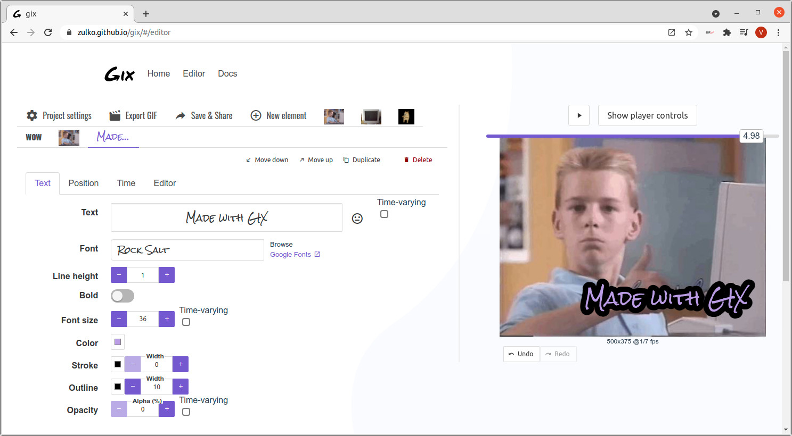

# Gix

Gix is a GIF editor using web technologies:

- No account needed, no privacy issues, no server costs: it runs entirely in your browser.
- Share your projects as (long!) URLs, so others can build on your work.
- Freely create, combine, caption and animate.
- An interface that ~~is clean and intuitive~~ makes your GIFs look good by comparison.

<p></p>

**This is still work in progress. Expect no stability**

## Project setup

```
yarn install
```

### Compiles and hot-reloads for development

```
yarn serve
```

### Compiles and minifies for production

```
yarn build
```
## Work in progress.

Gix is open source software originally written by Zulko and released on Github under the MIT License. 